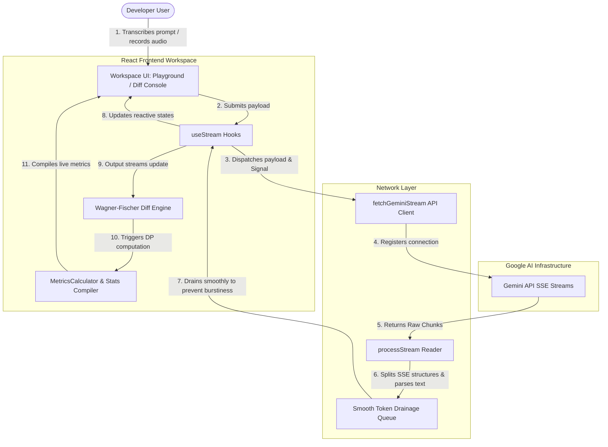
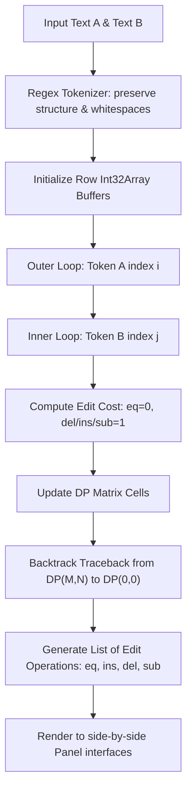

# Aetheris AI — Real-Time Inference Playground & Semantic Diff Console

Aetheris AI is a high-performance, developer-focused workspace built for real-time model interaction, multimodal analysis, and semantic comparison across Google Gemini large language model versions. 

Equipped with a native microphone processing pipeline, resilient Server-Sent Events (SSE) streaming infrastructure, dynamic metrics tracking, and a custom-built, token-level semantic diff engine, Aetheris AI serves as a comprehensive playground and benchmarking console for next-generation generative interfaces.

---

## Architecture Overview

Aetheris AI is structured as a decoupled React + TypeScript application that handles heavy text tokenization, real-time networking, and dynamic programming algorithms in-browser without server dependencies.

### 1. High-Level System Architecture



---

## Getting Started: Local Installation

To set up and launch Aetheris AI locally, ensure you have [Node.js](https://nodejs.org/) installed (v18+ recommended) and follow these steps:

### 1. Clone & Install Dependencies
Navigate to your project root folder and install all locked package distributions:
```bash
npm install
```

### 2. Configure Environment Secrets
Aetheris AI talks directly to Google Gemini's endpoints over a secure client-side channel. Create a `.env` file in the root directory and append your API Key:
```env
VITE_GEMINI_API_KEY=your_gemini_api_key_here
```
> [!NOTE]
> You can acquire a developer key directly from [Google AI Studio](https://aistudio.google.com/).

### 3. Launch Development Server
Boot up the fast Vite HMR server:
```bash
npm run dev
```
Open [http://localhost:5173](http://localhost:5173) in your browser to interact with the platform.

---

## Detailed Implementation Logic

### 1. Resilient SSE Streaming Pipeline
Standard web interfaces suffer from "stream burstiness"—where entire phrases appear on-screen in jagged, erratic clumps. Aetheris AI implements a custom streaming layer (`src/lib/streaming.ts`) that guarantees a smooth, human-readable typing effect.

```mermaid
sequenceDiagram
    participant API as Gemini API SSE
    participant Buffer as Accumulator Buffer
    participant Queue as tokenQueue (Array)
    participant Timer as Drainage Event Loop
    participant UI as Responsive Render State

    API->>Buffer: Transmits raw HTTP chunks
    Buffer->>Buffer: Appends and splits by double newline (\n\n)
    
    loop For each SSE data string
        Buffer->>Queue: Extracts 'data: ' and tokenizes text via (\S+\s*|\s+)
    end

    rect rgb(18, 18, 18)
        note right of Timer: Parallel asynchronous drain loop
        loop As long as queue has items
            Timer->>Queue: Shifts head token from array
            Queue->>UI: Appends token and triggers state render
            alt Queue depth > 40 tokens (Burst mitigation)
                Timer->>Timer: Wait 5ms (Rapid catchup)
            else Normal Speed
                Timer->>Timer: Wait 30ms (Smooth typing cadence)
            end
        end
    end
```



#### Multimodal Binary Extraction
For live microphone capabilities (`src/components/playground/PromptPanel.tsx`), the browser captures audio transients natively using the `MediaRecorder` API. 
1. Recorded waveforms are output as native `.webm`/`.mp4` `Blob` structures.
2. The blob is dynamically read and converted into a standard base64 string via a `FileReader` promise:
   ```typescript
   export const fileToBase64 = (file: File): Promise<string> => {
     return new Promise((resolve, reject) => {
       const reader = new FileReader();
       reader.readAsDataURL(file);
       reader.onload = () => resolve((reader.result as string).split(',')[1]);
       reader.onerror = error => reject(error);
     });
   };
   ```
3. This base64 payload is wrapped directly into a `GeminiRequestPayload` format under `parts.inlineData`, keeping the streaming engine completely agnostic of input types.

---

### 2. Live Playground Metrics
While streaming is active, the `MetricsCalculator` class (`src/lib/metrics.ts`) runs continuously to monitor performance:

*   **Token Count Estimation**:
    To minimize client overhead, tokens are dynamically estimated using the standard standard developer heuristic:
    $$\text{Estimated Tokens} = \left\lceil \frac{\text{Character Length}}{4} \right\rceil$$
*   **Latency (TTFT)**:
    Time-To-First-Token is measured using the browser's high-precision `performance.now()` timer. It represents the exact delta from dispatching the POST request to the extraction of the first valid SSE chunk.
*   **Tokens Per Second (TPS)**:
    Calculated relative to the first token arrival to filter out network connection overhead:
    $$\text{TPS} = \frac{\text{Total Tokens Recoded}}{\left( \frac{\text{Current Time} - \text{First Token Arrival Time}}{1000} \right)}$$

---

### 3. Wagner-Fischer Token-Level Diff Engine
The **Model Comparison (Diff View)** features a completely custom, dependency-free token-level diffing tool implementing the classical **Wagner-Fischer dynamic programming algorithm** for edit distances.



#### A. Regex Tokenizer (`src/lib/diff/tokenizer.ts`)
To make sure formatting and spacing are not corrupted during diff visualizations, the tokenizer uses an alternating regex pattern:
```typescript
export function tokenize(text: string): string[] {
  return text.match(/(\s+|[^\s]+)/g) || [];
}
```
This guarantees that **whitespace and line breaks are treated as distinct tokens** instead of being discarded. The reconstructed strings on both sides will match their original sources byte-for-byte.

#### B. The DP Matrix (`src/lib/diff/wagner-fischer.ts`)
For two token sequences $A$ of length $M$ and $B$ of length $N$, we allocate an $(M+1) \times (N+1)$ matrix using highly performant `Int32Array` rows:
1. **Base cases**:
   $$DP[i][0] = i \quad \forall \ i \in [0, M]$$
   $$DP[0][j] = j \quad \forall \ j \in [0, N]$$
2. **DP Recurrence**:
   For each cell $(i, j)$, if $A[i-1] == B[j-1]$, the substitution cost is 0. Otherwise, it is 1. The recurrence is:
   $$DP[i][j] = \min \begin{cases} 
      DP[i-1][j] + 1 & \text{(Deletion)} \\
      DP[i][j-1] + 1 & \text{(Insertion)} \\
      DP[i-1][j-1] + \text{cost} & \text{(Substitution)}
   \end{cases}$$

#### C. Traceback Logic
Once the DP matrix is filled, we trace backward from cell $(M, N)$ to $(0, 0)$ to reconstruct the optimal alignment path. 
*   If $A[i-1] == B[j-1]$, we move diagonally to $(i-1, j-1)$ (operation `eq`).
*   Otherwise, we compare the values of neighbors:
    *   If $DP[i][j]$ came from diagonal $DP[i-1][j-1]$, we record a substitution (`sub`) and move to $(i-1, j-1)$.
    *   If it came from top $DP[i-1][j]$, we record a deletion (`del`) and move to $(i-1, j)$.
    *   If it came from left $DP[i][j-1]$, we record an insertion (`ins`) and move to $(i, j-1)$.
*   We then reverse the resulting operation list so it reads sequentially from start to end.

---

### 4. Advanced Diff Analytics & Heuristics
The comparison console leverages the edit operations output from the Wagner-Fischer algorithm to run real-time semantic analysis:

#### A. Similarity Index
Measures the direct token-overlap ratio. An index of $100\%$ indicates absolute identity:
$$\text{Similarity Index} = \left( \frac{\text{Unchanged Operations}}{\text{Total Edit Operations}} \right) \times 100$$

#### B. Token Drift
Monitors structural balance. It tallies the exact insertions and deletions. Note that a substitution counts as both a deletion and an insertion:
$$\text{Drift Balance} = +(\text{Insertions} + \text{Substitutions}) \ / \ -(\text{Deletions} + \text{Substitutions})$$

#### C. Ratio-Based Confidence Score
Measures the overall precision of the diff and estimates model drift. While insertions simply expand on a concept, **substitutions represent structural drift** (hallucinations or vocabulary shifts). 

The scoring algorithm penalizes substitutions proportionally using a relative ratio to prevent long documents from getting penalized flatly:
$$\text{Substitution Ratio} = \frac{\text{Substitutions}}{\text{Total Edit Operations}}$$
$$\text{Confidence Score} = \text{Clamp} \left[ 0, \ 1, \ \left(\frac{\text{Similarity Index}}{100}\right) - (\text{Substitution Ratio} \times 0.5) \right]$$

---

## Design System Tokens & Surfaces

Following the rules of `DESIGN.md`, the platform is optimized for clean, developer-focused typography and cinematic dark-mode components:

| Token / Layer | Color Spec | Component Usage |
| :--- | :--- | :--- |
| **Level 0 (Background)** | `#0A0A0A` | Foundational layout background. |
| **Level 1 (Card/Container)**| `#121212` | Sidebar, prompt console, terminal panels. |
| **Borders** | `#262626` | 1px clean gridlines and element frames. |
| **Accent / Focus** | `#6366F1` | Primary call-to-action buttons, active navigation bars, text cursors. |
| **Typography** | `Geist` (sans-serif) | Body text, standard layout interfaces, controls. |
| **Technical Data** | `JetBrains Mono` | Code listings, system statuses, KPIs, labels. |

---

## License
Aetheris AI is distributed under the MIT License. Developed for enterprise-grade LLM observability.
